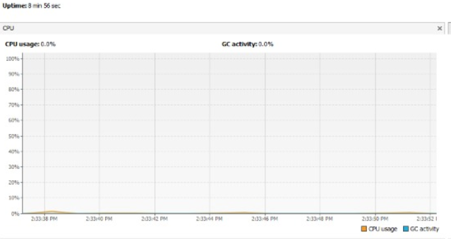
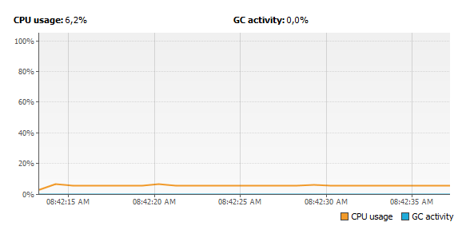

# lab 4
## Part l
I think that  the reason of the CPU consumption is because the program run of asynchronous way this cause that the progam have a elevete CPU execution.
The class  responsable of that consumption in the consumer because use all resources and  makes the program slow.

 - first execution of the progam
	

When i change the progam for resolve the problems of the comsumer and producer the CPU consumtion change radicaly 

 - Second execution of the progam
	
## Part ll
In the Black list search progam i put a synchronized in the iteration of thread and the progam explore the total of servers in the property way 
 - `Black list search repository`
	 - https://github.com/javargas1098/Threads
## Part lll
In the progam Highlander-simulator i agregate various parts of code, in the first part i implement  a pause and resume of the  game then i synchronized the health of the players for solve the problem of the sum of them, the i implement the stop that ends of threads and return the funtion to start the game again.  
